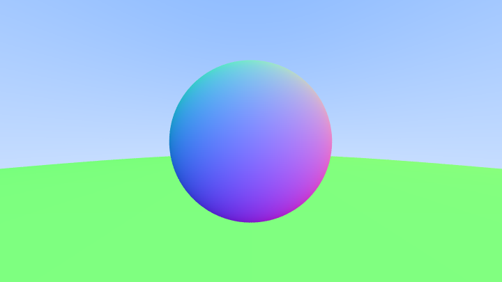
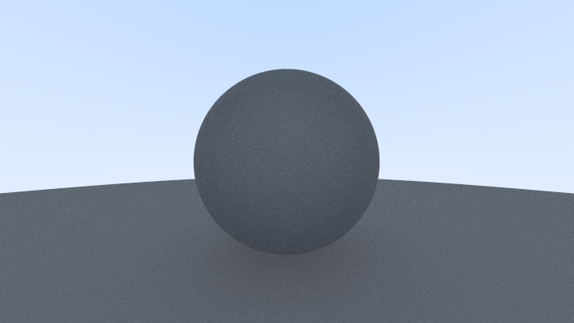
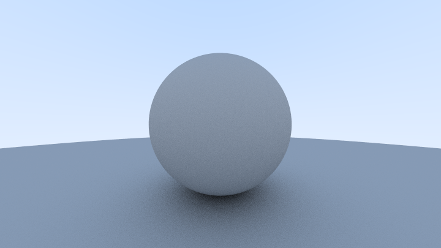
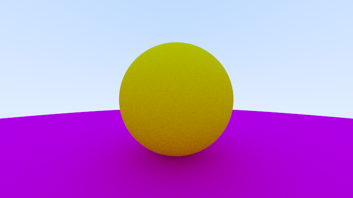
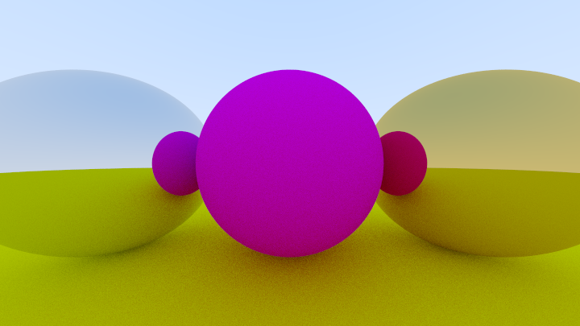
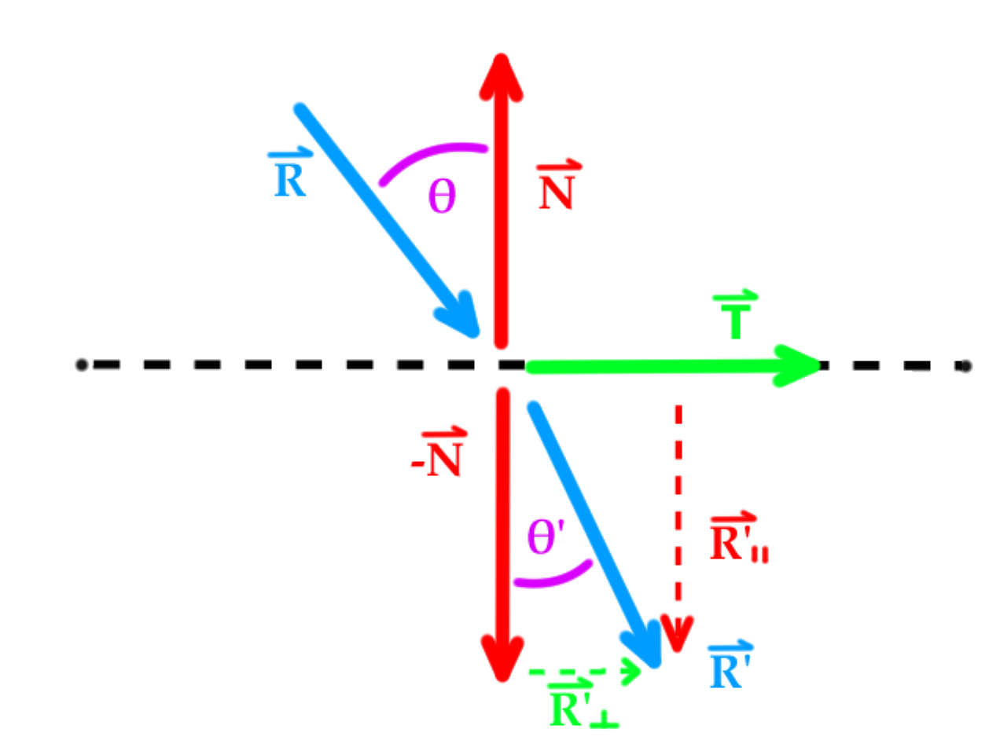

# Ray Tracing in One Week(end)

|  |
| :-: |
| *Final Render* |

This is my journey to learn ray tracing following [Peter Shirley](https://github.com/petershirley)'s first book on the subject. 
In this readme, I will try to explain how it went, both as a reminder for myself and a help for those who choose to follow the same course in Rust. Well, I am doing this mostly for myself, but explaining what you're doing is a good way of ensuring you understand your subject.

## Resources

As I said, this is my implementation of [Peter Shirley](https://github.com/petershirley)'s guide to ray tracing. So of course I followed his book, but I also relied on previous Rust implementations:

- [Ray Tracing in One Weekend](https://raytracing.github.io/books/RayTracingInOneWeekend.html) (first of [three books](https://github.com/RayTracing/raytracing.github.io))
- [akinnane's Rust implementation](https://github.com/akinnane/RayTracingInOneWeekend)
- [Nelarius' Rust implementation](https://github.com/Nelarius/weekend-raytracer-rust)

>As a side note, I also began watching [Dr. Károly Zsolnai-Fehér](https://www.youtube.com/c/K%C3%A1rolyZsolnai)'s course on YouTube ([TU Wien Rendering / Ray Tracing Course](https://youtube.com/playlist?list=PLujxSBD-JXgnGmsn7gEyN28P1DnRZG7qi)). I was at the 12th video by the end of this project.

## Why Another Rust Ray Tracing in One Weekend?

Why [Ray Tracing in One Weekend](https://raytracing.github.io/books/RayTracingInOneWeekend.html)? And why Rust? 
As I was learning Rust by myself, I wondered what kind of project I could do to practice. I always had an interest in CG graphics but never went further than some basic Blender, Unity and a few vulgarisation videos. I though it could be interesting to learn Rust through a 3D engine and [Ray Tracing in One Weekend](https://raytracing.github.io/books/RayTracingInOneWeekend.html) seems like a good start.

The reason I thought it was important to write this is to give you some context. I have some theoretical knowledge about CGI, but I am a **complete beginner** in both **computer graphics** and **Rust**. My only experience with the language come from the [rustlings](https://github.com/rust-lang/rustlings) exercises which I haven't even finished before getting to work. 

What I am trying to say is instead of an efficient implementation expect some weird experiments.

>I wrote this readme after completing this project over a period of one week. As I didn't use git from the start nor progressed in a methodical way some early code issue description and code illustration may be inaccurate.

# The journey

## The first image (PPM)

The first step was to create an image. For simplicity, the [book](https://raytracing.github.io/books/RayTracingInOneWeekend.html) uses the [PPM](https://en.wikipedia.org/wiki/Netpbm#PPM_example) format. As a text description of an image, it is indeed easy to manipulate.
>The image renders were [PPM](https://en.wikipedia.org/wiki/Netpbm#PPM_example) files, but I converted them to PNG for display. You can find the renders [here (./render)](./renders/).

At first I relied on the [format!](https://doc.rust-lang.org/std/macro.format.html) macro to concatenate the [strings](https://doc.rust-lang.org/std/string/index.html) which make up the [PPM](https://en.wikipedia.org/wiki/Netpbm#PPM_example) file with the new pixels at every loop. However, it proved to grow very slow with higher resolutions (we are talking about seconds for a simple color gradient).
```Rust
let mut render = format!("P3\n{} {}\n255", img_width, img_height);

for j in (0..img_height).rev() {
    for i in 0..img_width {
        // Color logic
        render = format!("{render}\n{r} {g} {b}");
    }   
}
render
```

Although I really should dive deeper into string manipulation in Rust, I worked around the issue by using a [Vec\<String>](https://doc.rust-lang.org/std/vec/index.html) instead and joining it at the end.
```Rust
let mut render = Vec::new();
render.push(format!("P3\n{} {}\n255", img_width, img_height));

for j in (0..img_height).rev() {
    for i in 0..img_width {
        // Color logic
        render.push(format!("{r} {g} {b}"));
    }
}
render.join("\n")
```

>I use ranges for my loops, mainly for readability and laziness. But from my understanding it shouldn't cost much if any performance ([Comparing Performance: Loops vs. Iterators](https://doc.rust-lang.org/book/ch13-04-performance.html)).

## Vec3 implementation (I should have use TDD)

Implementing Vec3 is straight forward. Rust operators are *"syntactic sugar for method calls"* ([Operator Overloading](https://doc.rust-lang.org/rust-by-example/trait/ops.html)) so as long as you know which [trait](https://doc.rust-lang.org/rust-by-example/trait.html) correspond to which operator it is easy to implement them. At least that's what I thought.

The thing is, there are many operators to override if you want a complete coverage and due to some quick copy and paste I mistakenly put **'y's** in place of **'z's** in some places.

> The "Hello world" background rendering showcased a different color as well as some weird round effects on the center of the picture. I could fix the artefact at the center by not normalizing (to unit vector) the raycast, but I didn't investigate the discoloration further. 
>
>That was dumb. Always question why your code does not give you the expected result.

I only caught the real issue when I tried to display the first sphere as it resulted in weird abstract pieces :

||
|:--:|
| *"Ceci n'est pas une sphère - Or how to fail your ray tracer"<br>Nicolas Guillaume Soulié* |

After some time, I managed to find the mistake using [unit tests](https://doc.rust-lang.org/book/ch11-01-writing-tests.html). So I do advise you to use [unit tests](https://doc.rust-lang.org/book/ch11-01-writing-tests.html) and/or [TDD (Test Driven Development)](https://en.wikipedia.org/wiki/Test-driven_development#Test-driven_development_cycle) for straight forward yet important part of your code like Vec3. 

> I have initially written my own tests for dot and cross products. However, I didn't expect typos on simpler operations. To debug faster I "stole" [Nelarius' unit tests](https://github.com/Nelarius/weekend-raytracer-rust/blob/master/src/vec3.rs). However, one mistake did manage to pass all the tests. I caught it when I started to deal with multi-sampling anti-aliasing as it whitened the image based on the number of rays.

||
|:--:|
|Normals after correction|

## Hittable abstraction with Traits

In Rust there is no inheritance. Instead the language uses [Traits implementations](https://doc.rust-lang.org/book/ch10-02-traits.html). 

>"Traits are similar to a feature often called interfaces in other languages, although with some differences."
>
>[The Rust "book", *Traits: Defining Shared Behavior*](https://doc.rust-lang.org/book/ch10-02-traits.html)

To abstract [Hittables](./src/raytracer/hittable.rs) in Rust, [traits](https://doc.rust-lang.org/book/ch10-02-traits.html) seem like the implementation closest to a parent class in C++. You have to use the [dyn](https://doc.rust-lang.org/rust-by-example/trait/dyn.html?highlight=dyn#returning-traits-with-dyn) keyword to explicit that you use dynamic types and wrap the Hittables structs in your list in smart pointers (like [Box](https://doc.rust-lang.org/book/ch15-01-box.html?highlight=box#enabling-recursive-types-with-boxes) or [Arc](https://doc.rust-lang.org/book/ch16-03-shared-state.html?highlight=arc#atomic-reference-counting-with-arct)).

```Rust
// Dyn type in smart pointer for list (Vec)
pub struct HittableList {
    pub objects: Vec<Arc<dyn Hittable>>,
}
// Dyn type used in functions/methods prototypes
pub fn render(world: &(dyn Hittable), samples: u16, max_depht: u16 ) -> String;
```

>In functions, we can only pass [references](https://doc.rust-lang.org/book/ch04-02-references-and-borrowing.html?highlight=references#references-and-borrowing) to a dynamic type. To quote the Rust compiler:
>
>*"Function arguments must have a statically known size, borrowed types always have a known size: `&`"*

Another possible implementation would be to use Rust [enums](https://doc.rust-lang.org/book/ch06-01-defining-an-enum.html) as a type wrapper. However, in my opinion, this implementation would make the addition of new hittable classes more tedious so I chose against it. I still used this approach with [materials](./src/raytracer/hittable/material.rs) if you are interested.

## Utilities for Rust

Multiple of the constants and utility functions needed in the [book](https://raytracing.github.io/books/RayTracingInOneWeekend.html#surfacenormalsandmultipleobjects/commonconstantsandutilityfunctions) are already available in Rust. You just need to import some of them.

### Common Constants & Utility Functions

```Rust
// Maximum float (f64 in my case)
f64::INFINITY

// PI (not needed)
std::f64::consts::PI

// Degree to radians
let degree: f64 = 90.0;
let radian: f64 = degree.to_radians();
```

### Some Random Number Utilities

```Rust
// Import 
use rand::{thread_rng, Rng};

// Get a reference to the thread-local generator
let mut rng: ThreadRng = thread_rng();

// Generate a number in range
let random_number = rng.gen_range(min..max);
```

## Materials through enums

For the materials implementation, I chose to rely on an [enum](https://doc.rust-lang.org/book/ch06-01-defining-an-enum.html) wrapper. The scatter method of the [enum](https://doc.rust-lang.org/book/ch06-01-defining-an-enum.html) use a [match control flow](https://doc.rust-lang.org/book/ch06-02-match.html) to call the scatter method of the wrapped material type.

```Rust
pub enum Material {
    Lambertian(Lambertian),
    // ...
}

impl Material {
    pub fn scatter(&self, r_in: &Ray, rec: &mut HitRecord, rng: &mut ThreadRng) ->  (Vec3, Ray) {
        match self {
            Material::Lambertian(l) => l.scatter(rec, rng),
            // ...
        }
    }
}
```
### Diffuse implementation

The diffuse [material implementation](./src/raytracer/hittable/material.rs) was relatively without issue. At first my results were very dark compared to the [book](https://raytracing.github.io/books/RayTracingInOneWeekend.html#diffusematerials/limitingthenumberofchildrays), but I couldn't find why. After the shadow acne fix I obtained closer results.

|| ||
|:---:|:---:|:---:|
|Diffuse|Gamma correction|Shadow acne fix|

|||
|:--:|:--:|
|Lambertian diffuse|Colored lambertian diffuse|

### Metal implementation

Implementing a metallic [material](./src/raytracer/hittable/material.rs) was uneventful. I already explained my abstraction of [materials](./src/raytracer/hittable/material.rs) previously so all I can give you are pretty visuals:

|||
|:--:|:--:|
|Metallic reflection|Fuzzy reflection|

### Dielectric implementation

#### Refraction Vector Formulas Demonstration

The [book](https://raytracing.github.io/books/RayTracingInOneWeekend.html#dielectrics/snell'slaw) gives us formulas for computing $R^′$ without telling us how it works. Here I will try to demonstrate why they work.

We want to demonstrate: 

$$R^′\_{⊥}=\frac{η}{η′}⋅(R+cosθn)$$

$$R^′\_{∥}=−\sqrt{1−|R^′\_{⊥}|^2}N$$

||
|:--:|
| Refraction|

We have $N$, $T$, $R$ and $R^′$ of unit length, with $T$ perpendicular to $N$. We also know that:

$$R = R\_{⊥}+R_{∥}$$

$$R^′=R^′\_{⊥}+R^′\_{∥}$$

$$sinθ^′=\frac{η}{η′}⋅sinθ$$

With $\_{⊥}$ and $\_{∥}$ respectively indicating the vector is perpendicular/parallel to $N$ :

$$
\begin{cases}
R\_{⊥} = Tsinθ\\
R\_{∥} = -Ncosθ\\
\end{cases}
\begin{cases}
R^′\_{⊥} = Tsinθ^′\\
R^′\_{∥} = -Ncosθ^′\\
\end{cases}
$$

Therefor we can define ${R^′\_{⊥}}$ based on ${R\_{⊥}}$:

$$R^′\_{⊥} = Tsinθ^′$$

$$R^′\_{⊥} = \frac{η}{η′}⋅Tsinθ$$

$$R^′\_{⊥} = \frac{η}{η′}⋅R\_{⊥}$$

And since:

$$R\_{⊥} = R - R\_{∥}$$

$$R\_{⊥} = R + Ncosθ$$

We have: 

>$$R^′\_{⊥} = \frac{η}{η′}⋅(R + Ncosθ)$$

Next we can express $R^′\_{∥}$ using $R^′\_{⊥}$ thanks to trygonometry $(cos^2θ + sin^2θ = 1)$:

$$R^′\_{∥} = -Ncosθ^′$$

$$R^′\_{∥} = -N⋅\sqrt{cos^2θ^′}$$

$$R^′\_{∥} = -N⋅\sqrt{(1 - sin^2θ^′)}$$

Because $|R^′\_{⊥}| = |T|sinθ^′ = sinθ^′$ since $T$ is of unit length:

>$$R^′\_{∥} = -N\sqrt{1 -|R^′\_{⊥}|^2}$$

#### The refraction bug


||
|:--:|
| Where is my refraction?|


## Multi-Threading with Rayon

## Fov distortion

## Final render

## Closing thoughts
